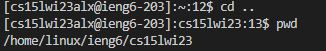

Hello, this is Shan He!
# Lab Report 1
## Installing VScode
* Go to VScode website and follow the instructions to install VScode for your computer. Note that you should downdoad the correct version for your operating system (Website Link: [Link](https://code.visualstudio.com/)).
* When it is done installing you can open VScode, and it should look like this: 
## Remotely Connecting
* Look up your corresponding account for CSE15L: [Link](https://sdacs.ucsd.edu/~icc/index.php)
* Please follow the steps below to reset your password.
* Go to [Link](https://sdacs.ucsd.edu/~icc/index.php)
* In `Account Lookup`, enter your UCSD username and PID accordingly.
* Make sure to install git bash on your computer: [Link](https://git-scm.com/download/win)
* Open VSCode and press and hold `Ctrl +` `to open the terminal.
* Open the command palette using `Ctrl + Shift + P`.
* Type in **Select Default Profile**.
* Click Git Bash from the options.
* Click on the + icon in the terminal window.
* The new terminal is a Git Bash terminal now, and you can type in commands.
* In the Git Bash terminal type in the following command:
`$ ssh ACCOUNT@ieng6.ucsd.edu` (replace the `ACCOUNT` with your course-specific account).
* Your terminal should look something like the following after pressing enter: 
```
⤇ ssh cs15lwi23zz@ieng6.ucsd.edu
The authenticity of host 'ieng6-202.ucsd.edu (128.54.70.227)' can't be established.
RSA key fingerprint is SHA256:ksruYwhnYH+sySHnHAtLUHngrPEyZTDl/1x99wUQcec.
Are you sure you want to continue connecting (yes/no/[fingerprint])? 
Password: 
```
* Type yes for the question and enter your password to log in.
* After successfully logging in, your terminal should look like this: 
## Trying Some Commands
* `ls -lat` (shows a list of files or directory in the current directory) 
* `cd ..` (change to parent directory) 
* `pwd` (shows the working directory) 
* `cd /home/linux/ieng6/cs15lwi23/cs15lwi23xyz` (swap the `xyz` with your username, this command changes directory to your account's directory on the remote computer) 
